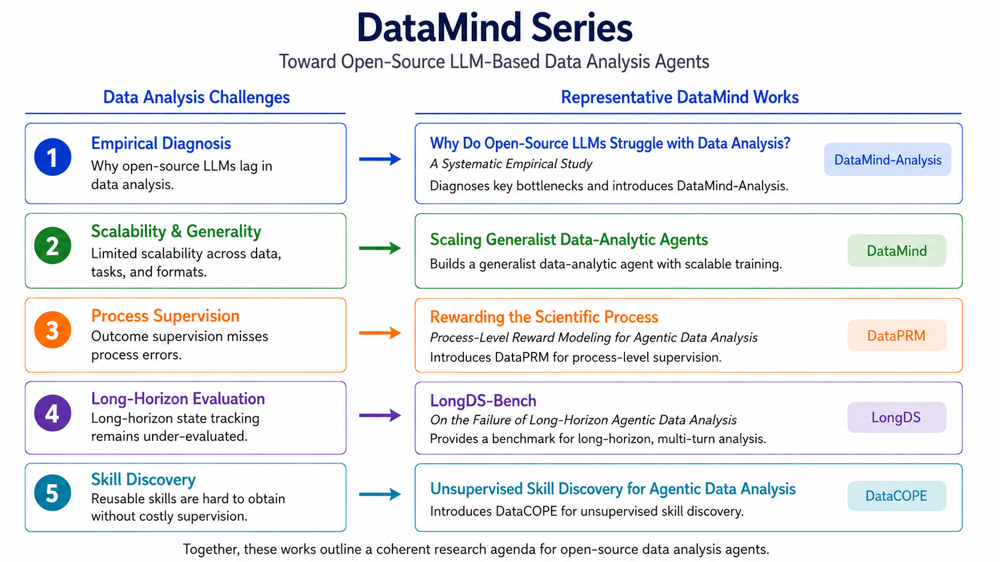

<h1 align="center"> DataMind </h1>

<p align="center">
  <a href="https://arxiv.org/abs/2509.25084">📄arXiv</a> •
  <a href="https://huggingface.co/collections/zjunlp/datamind-687d90047c58bb1e3d901dd8">🤗HuggingFace</a>
</p>


<div align="center">

[](https://github.com/zjunlp/DataMind) 
[](https://opensource.org/licenses/Apache-2.0)
 

</div>

<h5 align="center"> ⭐ If you like our project, please give us a star on GitHub for the latest updates!</h5>

---

**DataMind** develops open-source LLM-based data analysis agents from multiple perspectives, including empirical diagnosis, generalist agent scaling, process-level supervision, long-horizon evaluation, and unsupervised skill discovery. Together, these works provide a systematic path toward more capable, scalable, and reliable data-analytic agents.

<div align=center></div>

## 📢 News
- **[2026-06]** 🚀 We release a new paper: "[Unsupervised Skill Discovery for Agentic Data Analysis](https://arxiv.org/abs/2606.06416)".
  
- **[2026-06]** 🚀 We release a [tutorial](docs/project-level-skills-guide.md) on using data-analysis skills in Claude Code and Codex. We welcome users to try it.

- **[2026-05]** 🚀 We release a new paper: "[LongDS-Bench: On the Failure of Long-Horizon Agentic Data Analysis](https://arxiv.org/abs/2605.30434)".

- **[2026-05]** 🎉🎉🎉 Our paper "Rewarding the Scientific Process: Process-Level Reward Modeling for Agentic Data Analysis" has been accepted to KDD 2026.

- **[2026-04]** 🚀 We release a new paper: "[Rewarding the Scientific Process: Process-Level Reward Modeling for Agentic Data Analysis](https://arxiv.org/abs/2604.24198)".

- **[2026-01]** 🎉🎉🎉 Our paper "Scaling Generalist Data-Analytic Agents" has been accepted to ICLR 2026.

- **[2025-11]** 🎉🎉🎉 Our paper "Why Do Open-Source LLMs Struggle with Data Analysis? A Systematic Empirical Study" has been accepted to AAAI 2026.

- **[2025-09]** 🚀 We release a new paper: "[Scaling Generalist Data-Analytic Agents](https://arxiv.org/abs/2509.25084)".

- **[2025-06]** 🚀 We release a new paper: "[Why Do Open-Source LLMs Struggle with Data Analysis? A Systematic Empirical Study](https://arxiv.org/pdf/2506.19794)".


## 🧭 Project Navigation
This repository hosts multiple data analysis projects. The table below provides an overview and links to each project's documentation:

| Project                | Description                                                                                                  | Paper                                         | Documentation                                  |
| :-------------------- | :----------------------------------------------------------------------------------------------------------- | :-------------------------------------------- | :--------------------------------------------- |
| **DataMind-Analysis** | Empirical diagnosis and targeted training for understanding why open-source LLMs struggle with data analysis | [AAAI 2026](https://arxiv.org/abs/2506.19794)     | [DataMind-Analysis.md](./datamind-analysis/README.md) |
| **DataMind**          | Scalable data synthesis and agent training recipe for building generalist data-analytic agents               | [ICLR 2026](https://arxiv.org/abs/2509.25084) | [DataMind.md](./datamind/README.md)                   |
| **DataPRM**           | Environment-aware process reward model for reliable multi-step data analysis                                 | [KDD 2026](https://arxiv.org/abs/2604.24198)     | [DataPRM.md](./dataprm/README.md)                     |
| **LongDS-Bench**      | Long-horizon benchmark for evaluating analytical state management in multi-turn data analysis                | [arXiv](https://arxiv.org/abs/2605.30434)     | [LongDS-Bench.md](./longds/README.md)           |
| **DataCOPE**          | Unsupervised verifier-guided skill discovery framework for data-analytic agents                              | [arXiv](https://arxiv.org/abs/2606.06416)     | coming soon                   |


## 🎉Contributors

<a href="https://github.com/zjunlp/DataMind/graphs/contributors">
  </a>


We deeply appreciate the collaborative efforts of everyone involved. We will continue to enhance and maintain this repository over the long term. If you encounter any issues, feel free to submit them to us!


## ✍️ Citation

If you find our work helpful, please use the following citations.

```
@misc{qiu2026unsupervisedskilldiscoveryagentic,
      title={Unsupervised Skill Discovery for Agentic Data Analysis}, 
      author={Zhisong Qiu and Kangqi Song and Shengwei Tang and Shuofei Qiao and Lei Liang and Huajun Chen and Shumin Deng},
      year={2026},
      eprint={2606.06416},
      archivePrefix={arXiv},
      primaryClass={cs.AI},
      url={https://arxiv.org/abs/2606.06416}, 
}

@misc{xu2026longdsbench,
      title={LongDS-Bench: On the Failure of Long-Horizon Agentic Data Analysis}, 
      author={Kewei Xu and Xiaoben Lu and Shuofei Qiao and Zihan Ding and Haoming Xu and Lei Liang and Ningyu Zhang},
      year={2026},
      eprint={2605.30434},
      archivePrefix={arXiv},
      primaryClass={cs.LG},
      url={https://arxiv.org/abs/2605.30434}, 
}

@article{qiu2026rewarding,
  title={Rewarding the scientific process: Process-level reward modeling for agentic data analysis},
  author={Qiu, Zhisong and Qiao, Shuofei and Xu, Kewei and Zhu, Yuqi and Du, Lun and Zhang, Ningyu and Chen, Huajun},
  journal={arXiv preprint arXiv:2604.24198},
  year={2026}
}

@article{qiao2025scaling,
  title={Scaling Generalist Data-Analytic Agents},
  author={Qiao, Shuofei and Zhao, Yanqiu and Qiu, Zhisong and Wang, Xiaobin and Zhang, Jintian and Bin, Zhao and Zhang, Ningyu and Jiang, Yong and Xie, Pengjun and Huang, Fei and others},
  journal={arXiv preprint arXiv:2509.25084},
  year={2025}
}

@article{zhu2025open,
  title={Why Do Open-Source LLMs Struggle with Data Analysis? A Systematic Empirical Study},
  author={Zhu, Yuqi and Zhong, Yi and Zhang, Jintian and Zhang, Ziheng and Qiao, Shuofei and Luo, Yujie and Du, Lun and Zheng, Da and Chen, Huajun and Zhang, Ningyu},
  journal={arXiv preprint arXiv:2506.19794},
  year={2025}
}
```
