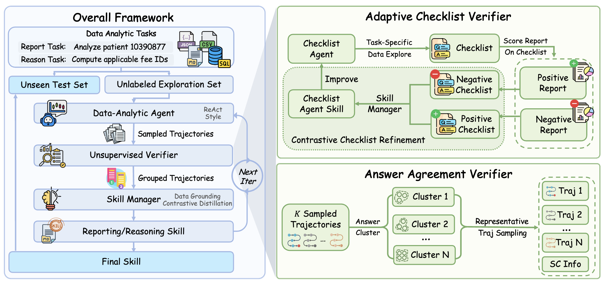

<h1 align="center"> DataCOPE </h1>

<p align="center">
  <a href="https://arxiv.org/abs/2606.06416">📄 arXiv</a>
</p>

## Table of Contents

- 👀 [Overview](#overview)
- 🔧 [Installation](#installation)
- 📦 [Data](#data)
- 💻 [Running DataCOPE General Framework](#running-datacope-general-framework)
- 📝 [Running Report-Style Tasks](#running-report-style-tasks)
- 🧠 [Running Reasoning-Style Tasks](#running-reasoning-style-tasks)
- 🙏 [Acknowledgements](#acknowledgements)
- 📖 [Citation](#citation)

---

## 👀 Overview

**DataCOPE** is an unsupervised verifier-guided framework for discovering reusable skills for data-analytic agents.

Instead of updating model parameters or relying on costly human supervision, DataCOPE improves agents at inference time by distilling procedural skills from unlabeled exploration trajectories. It coordinates three components: a **Data-Analytic Agent** that generates trajectories, an **Unsupervised Verifier** that extracts quality signals, and a **Skill Manager** that turns contrastive trajectory feedback into reusable skills.

DataCOPE supports both major data-analysis formats:

* **Report-style analysis**: uses an Adaptive Checklist Verifier to derive task-specific evaluation criteria and score reports by verifiable coverage.
* **Reasoning-style analysis**: uses an Answer Agreement Verifier to cluster trajectories by answer agreement and estimate reliability through self-consistency.

We evaluate DataCOPE on **Deep Data Research** and **DABStep**. Across four model settings, DataCOPE consistently improves held-out performance, achieving average gains of 9.71% on report-style tasks and 32.30% on reasoning-style tasks.

<p align="center">
  
</p>


## 🔧 Installation

This repository contains three related code paths:

- `general/`: a configurable DataCOPE loop for custom data-analysis tasks.
- `report_task/`: the report-style task implementation in paper based on DDR-Bench and Deep Data Research.
- `reason_task/`: the reasoning-style task implementation in paper  based on DABStep and DSGym.

### 📋 Prerequisites

- Python 3.10 or newer for `general/` and `report_task/`.
- Python 3.12 or newer is recommended for `reason_task/`.
- Docker or a local DSGym-compatible executor manager when using ReAct/DSGym execution.
- Claude Code or Codex if you use those agent harnesses.
- API access to the model provider used by the data-analysis agent, verifier, evaluator, or skill manager.

### ⚙️ Environment Setup

Each subproject maintains its own dependency and runtime instructions:

- General DataCOPE framework: [general/README.md](general/README.md)
- Report-style task experiments: [report_task/README.md](report_task/README.md)
- Reasoning-style task experiments: [reason_task/README.md](reason_task/README.md)

If you use Claude Code or Codex, install and authenticate the corresponding CLI before running those harnesses:

```bash
# Claude Code
curl -fsSL https://claude.ai/install.sh | bash
claude

# Codex
curl -fsSL https://chatgpt.com/codex/install.sh | sh
codex login
```

### 🐳 Execution Environment

The ReAct-style agent use a DSGym-style executor manager at `http://localhost:5005`. See [general/README.md](general/README.md) and [reason_task/README.md](reason_task/README.md) for the concrete executor setup. Agents such as `codex` and `claude_code` may not need the executor manager, depending on the selected runtime and task.

## 📦 Data

Data preparation is task-specific:

- `general/` expects paired task and data directories under `general/data/`; see [general/README.md](general/README.md).
- `report_task/` supports the 10-K, MIMIC, and GLOBEM report-style scenarios; see [report_task/README.md](report_task/README.md).
- `reason_task/` uses DABStep data in its DSGym directories; see [reason_task/README.md](reason_task/README.md).

## 💻 Running DataCOPE General Framework

`general/` is the reusable DataCOPE pipeline for custom data-analysis tasks. It supports configurable task loaders, agent harnesses, verifiers, skill managers, iterative skill refinement, and resume controls.

For setup, task format, configuration fields, and CLI usage, see [general/README.md](general/README.md).

## 📝 Running Report-Style Tasks

`report_task/` contains the DataCOPE report-style pipeline and the DDR-Bench runner/evaluator for Deep Data Research tasks. It covers skill generation, agent execution with or without skills, and LLM-as-checker evaluation.

Pre-generated skills from the paper experiments are available under [report_task/skill](report_task/skill).

For data preparation, configuration, skill generation, agent runs, and evaluation commands, see [report_task/README.md](report_task/README.md).

## 🧠 Running Reasoning-Style Tasks

`reason_task/` contains the DataCOPE reasoning-style pipeline for DABStep. It has two stages: skill generation on the explore split and skill evaluation on the test split.

The provided reasoning-task skills are organized as:

```text
reason_task/eval/skill/
├── 0/iter0 ... iter2/
├── 1/iter0 ... iter2/
└── 2/iter0 ... iter2/
```

For environment setup, DABStep data placement, generation commands, and evaluation commands, see [reason_task/README.md](reason_task/README.md). The generation and evaluation subpipelines also have detailed READMEs: [reason_task/generation/README.md](reason_task/generation/README.md) and [reason_task/eval/README.md](reason_task/eval/README.md).

## 🙏 Acknowledgements

We thank the [DSGym](https://github.com/fannie1208/DSGym) team for the data-analysis evaluation framework used by the reasoning-style task pipeline.

We thank the authors of [DDR_Bench](https://github.com/thinkwee/DDR_Bench) for releasing benchmark resources and task settings for report-style data analysis.

## 📖 Citation

If you use DataCOPE, please cite:

```bibtex
@misc{qiu2026unsupervisedskilldiscovery,
      title={Unsupervised Skill Discovery for Agentic Data Analysis},
      author={Zhisong Qiu and Kangqi Song and Shengwei Tang and Shuofei Qiao and Lei Liang and Huajun Chen and Shumin Deng},
      year={2026},
      eprint={2606.06416},
      archivePrefix={arXiv},
      primaryClass={cs.AI},
      url={https://arxiv.org/abs/2606.06416},
}
```
