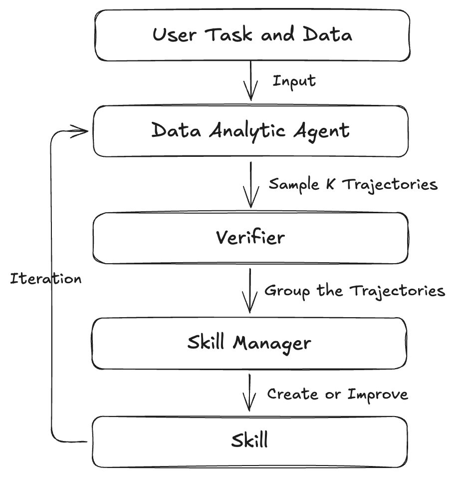

# 🚀 DataCOPE General Framework

**DataCOPE General Framework** is a configurable loop for generating and refining reusable skills for data-analysis agents.

It runs an agent on a task set, verifies the generated trajectories, and uses verification feedback to create or improve transferable `SKILL.md` and related files.

The pipeline contains three main stages:

1. **`da_agent`** — Solves data-analysis questions with a registered agent. Currently supported agent harnesses include `Claude Code`, `Codex`, and `ReAct`.
2. **`verifier`** — Reviews one or more agent trajectories and selects useful examples for skill generation or refinement.
3. **`skill_manager`** — Creates or updates reusable skills from verified trajectories. Currently supported skill-manager harnesses include `Claude Code` and `Codex`.

<p align="center">
  
</p>

---

## 📚 Table of Contents

* [Repository Layout](#-repository-layout)
* [Installation](#-installation)
* [Quick Start](#-quick-start)
* [How the Loop Works](#-how-the-loop-works)
* [Configuration Reference](#-configuration-reference)
* [Resuming a Run](#-resuming-a-run)
* [Container Runtime](#-container-runtime)
* [Extending DataCOPE](#-extending-datacope)

---

## 📁 Repository Layout

```text
general/
|-- config.yaml                 # Default run configuration
|-- start.sh                    # Convenience runner
|-- data/
|   |-- task/{task_name}/        # Task files
|   `-- data/{task_name}/        # Data files referenced by tasks
`-- src/
    |-- core/                    # CLI, config loading, and execution loop
    |-- da_agent/                # Agent evaluation wrappers and prompts
    |-- task_processor/          # Dataset loaders
    |-- verifier/                # Verification strategies
    |-- skill_manager/           # Skill generation and modification
    `-- runtimes/                # Agent implementations and execution backends
                                # Supports claude_code, codex, and react
```

---

## ⚙️ Installation

### 🐍 Python Environment

Use **Python 3.10 or newer**.

```bash
conda create -n datacope python=3.10
conda activate datacope
pip install -e .
```

If you use the ReAct-style container runtime, you also need to start the executor manager described in [Container Runtime](#-container-runtime).

If your task requires additional Python packages, install them in the appropriate environment:

* For `codex` and `claude_code` agents, install packages in the local environment.
* For the `react` agent, install packages in the container environment.

### 🤖 Agent Harness Environment

Before using `claude_code` or `codex`, make sure the corresponding CLI/tool is installed, your account is configured and the CLI can be used normally.

```bash
# Claude Code
curl -fsSL https://claude.ai/install.sh | bash

# Codex
curl -fsSL https://chatgpt.com/codex/install.sh | sh
```

---

## ⚡ Quick Start

This guide shows how to prepare your own data-analysis tasks and run DataCOPE.

At a high level, you need to:

1. Put your task descriptions under `data/task/`.
2. Put the data files used by those tasks under `data/data/`.
3. Edit `config.yaml`.
4. Run the pipeline.

We use the built-in `dabstep` task as a concrete example throughout this section.

---

### 1. Prepare Your Task Files

Each task should have a task name, such as `dabstep`.

For a task named `dabstep`, place the task JSON file here:

```text
data/task/dabstep/explore.json
```

Here:

| Name      | Meaning                                              |
| --------- | ---------------------------------------------------- |
| `dabstep` | The task name.                                       |
| `explore` | The dataset name. The actual file is `explore.json`. |

A task file should be a JSON list. Each item describes one data-analysis question:

```json
[
  {
    "task_id": "1741",
    "query": "What are the applicable fee IDs for Belles_cookbook_store in 2023?",
    "data_files": [
      "acquirer_countries.csv",
      "fees.json",
      "manual.md",
      "merchant_category_codes.csv",
      "merchant_data.json",
      "payments-readme.md",
      "payments.csv"
    ],
    "ground_truth": "36, 51, 53, 64, 65, 107, 123, 150, 154, 163, 231, 249, 276, 286, 319, 347, 381, 384, 394, 398, 428, 454, 470, 471, 473, 477, 536, 556, 572, 595, 608, 626, 680, 709, 725, 741, 813, 868, 895, 939, 960",
    "metadata": {
      "level": "hard",
      "category": "Applicable_Fee_IDs"
    }
  }
]
```

Required fields:

| Field        | Meaning                                                  |
| ------------ | -------------------------------------------------------- |
| `query`      | The question that the data-analysis agent should answer. |
| `data_files` | The files needed to answer the question.                 |

Optional fields:

| Field               | Meaning                                                                                         |
| ------------------- | ----------------------------------------------------------------------------------------------- |
| `task_id`           | A unique ID for the task.                                                                       |
| `ground_truth`      | The reference answer. This is useful when using a supervised verifier.                          |
| `metadata.category` | The task category. If provided, DataCOPE can generate separate skills for different categories. |

---

### 2. Prepare the Data Files

All files listed in `data_files` should be placed under:

```text
data/data/{task_name}/
```

For example, if your task name is `dabstep`, the data files should be placed under:

```text
data/data/dabstep/
```

The directory structure should look like this:

```text
data/
|-- task/
|   `-- dabstep/
|       `-- explore.json
`-- data/
    `-- dabstep/
        |-- acquirer_countries.csv
        |-- fees.json
        |-- manual.md
        |-- merchant_category_codes.csv
        |-- merchant_data.json
        |-- payments-readme.md
        `-- payments.csv
```

In other words, this task item:

```json
"data_files": ["fees.json", "payments.csv"]
```

means DataCOPE will look for:

```text
data/data/dabstep/fees.json
data/data/dabstep/payments.csv
```

---

### 3. Edit `config.yaml`

Use `config.yaml` to tell DataCOPE which task to run, which agents to use, and where to save outputs.

For example:

```yaml
task: dabstep
dataset: explore

workspace_dir: outputs/dabstep_case
run_name: first_run

iterations: 1

category_list:
  - Average_Transaction_Value_Stats
  - Applicable_Fee_IDs
  - Total_Fees_Calculation

# react server, only used in react agent
backend: openai
manager_url: http://localhost:5005

da_agent:
  agent_type: codex
  model: gpt-5.5
  api_key: your_api_key
  base_url: your_base_url

  max_workers: 3
  sample_nums: 3

  # only used in react agent
  max_turns: 20
  temperature: 1.0
  top_p: 1.0
  max_tokens: 16384

verifier:
  name: supervised

skill_manager:
  agent_type: claude_code
  model: claude-sonnet-4-6
  api_key: your_api_key
  base_url: your_base_url
  max_workers: 3
```

The most important fields are:

| Field           | Meaning                                                                                               |
| --------------- | ----------------------------------------------------------------------------------------------------- |
| `task`          | The task name. For example, `dabstep` means DataCOPE reads tasks from `data/task/dabstep/`.           |
| `dataset`       | The dataset file name without `.json`. For example, `explore` means `data/task/dabstep/explore.json`. |
| `workspace_dir` | Root output directory.                                                                                |
| `run_name`      | Name of the current run. Outputs are saved to `{workspace_dir}/{run_name}/`.                          |
| `iterations`    | Number of skill-refinement iterations. Set it to `0` to only create the initial skill.                |
| `category_list` | Categories to run. These should match `metadata.category` in the task file.                           |
| `da_agent`      | The data-analysis agent that solves tasks.                                                            |
| `verifier`      | The verifier that evaluates or groups trajectories.                                                   |
| `skill_manager` | The agent that writes or updates skills.                                                              |

Supported agent types:

```text
da_agent.agent_type: codex, claude_code, react
skill_manager.agent_type: codex, claude_code
```

We recommend using `claude_code` as the skill manager.

---

### 4. Run the Pipeline

Start DataCOPE with:

```bash
./start.sh
```

DataCOPE will run the following stages:

```text
Data-analysis agent  ->  Verifier  ->  Skill manager
```

During this process:

1. The data-analysis agent solves the tasks.
2. The verifier checks or groups the generated trajectories.
3. The skill manager writes reusable skills from the verified trajectories.

---

### 5. Check the Outputs

Outputs are saved to:

```text
{workspace_dir}/{run_name}/
```

For the example configuration above, outputs are saved to:

```text
outputs/dabstep_case/first_run/
```

The output directory should look like this:

```text
outputs/dabstep_case/first_run/
|-- da_agent/iter_0/             # Agent predictions and trajectories
|-- verifier/iter_0/             # Verification results and skill prompts
|-- skill_manager/iter_0/skills/ # Generated skills
`-- stage_success_status.json    # Stage-level run status
```

The generated skills are saved under:

```text
outputs/dabstep_case/first_run/skill_manager/iter_0/skills/
```

You can follow the [project-level skills tutorial](docs/project-level-skills-guide.md) to use the generated skills in Codex or Claude Code.

---

### 6. Run Your Own Task

To run your own task, use the same structure.

For example, if your task is named `my_task` and your dataset file is `explore.json`, prepare:

```text
data/task/my_task/explore.json
data/data/my_task/
```

Then update `config.yaml`:

```yaml
task: my_task
dataset: explore
```

If your task file contains categories, add them to `category_list`:

```yaml
category_list:
  - Category_A
  - Category_B
```

If you do not need category-specific skills, you can leave `metadata.category` empty in the task file and omit `category_list` from the configuration.

---

## 🔁 How the Loop Works

With `iterations: N`, DataCOPE runs the following loop:

```text
iteration 0: da_agent -> verifier.init_run -> skill_manager.create
iteration 1: da_agent with skills -> verifier.iterate_run -> skill_manager.modify
iteration 2: da_agent with updated skills -> verifier.iterate_run -> skill_manager.modify
...
iteration N
```

Generated skills from iteration `i` are used by the data-analysis agent in iteration `i + 1`.

---

## 🧩 Configuration Reference

### Top-Level Fields

| Field           | Description                                                              |
| --------------- | ------------------------------------------------------------------------ |
| `task`          | Task name. Maps to `data/task/{task}` and `data/data/{task}`.            |
| `dataset`       | Dataset split or file name without `.json`, such as `explore`.           |
| `workspace_dir` | Root output directory for generated files.                               |
| `run_name`      | Name of the current run under `workspace_dir`.                           |
| `iterations`    | Number of iterations. If set to 0, DataCOPE only creates the initial skill. Larger values enable iterative skill improvement.     |
| `resume_from_iteration` | The resume iteration. `resume_from_iteration <= iterations`  |
| `resume_from_stage` |  The resume stage. It can be set to `[da_agent, verifier, skill_manager]` |
| `category_list` | Optional list of `metadata.category` values to run separately.           |
| `backend`       | Backend type. Only for ReAct Agent. Currently, `openai` is registered for ReAct backend calls. |
| `manager_url`   | URL of the container manager used by ReAct-style code execution. Only for ReAct Agent.          |
### `da_agent` Fields

| Field                                | Description                                                                                                 |
| ------------------------------------ | ----------------------------------------------------------------------------------------------------------- |
| `agent_type`                         | Registered agent type. Options include `react`, `codex`, and `claude_code` when dependencies are installed. |
| `model`                              | Model name passed to the agent backend.                                                                     |
| `api_key`                            | Provider API key.                                                    |
| `base_url`                           | Provider-compatible API endpoint.                                                                           |
| `max_workers`                        | Number of tasks processed in parallel.                                                                      |
| `sample_nums`                        | Sample num of trajectories                                                  |
| `max_turns`                          | Maximum interaction turns per task. Only for ReAct Agent.  |
| `temperature`, `top_p`, `max_tokens` | Generation parameters. Only for ReAct Agent.                                                                                     |
| `start_index`, `limit` | dataset split parameters.                                                                        |
### `verifier` Fields

| Field  | Description                                                                         |
| ------ | ----------------------------------------------------------------------------------- |
| `name` | Registered verifier name. Built-ins currently include `supervised` and `agreement`. |

### `skill_manager` Fields

| Field         | Description                                              |
| ------------- | -------------------------------------------------------- |
| `agent_type`  | Agent used to write or revise skills.                    |
| `model`       | Model name used for skill generation.                    |
| `api_key`     | Provider API key. |
| `base_url`    | Provider-compatible API endpoint.                        |
| `max_workers` | Number of skill categories processed in parallel.        |

---

## 🧪 Common CLI Usage

Command-line flags override `config.yaml`.

```bash
./start.sh --run-name debug_run
./start.sh --da-limit 10 --da-start-index 20
./start.sh --iterations 0
./start.sh --da-agent-type codex --da-model gpt-5.5
```

---

## ♻️ Resuming a Run

If a run stops midway, resume from a specific iteration and stage:

```bash
./start.sh \
  --resume-from-iteration 1 \
  --resume-from-stage verifier
```

Valid stages are:

```text
da_agent
verifier
skill_manager
```

The runner reads `stage_success_status.json` from the run directory and skips earlier stages according to the resume settings.

---

## 📦 Container Runtime

The ReAct agent uses an HTTP manager to allocate execution containers.

The configuration below is designed for a local environment. If you use Docker, refer to [DSGym](https://github.com/fannie1208/DSGym) for setup.

### Environment Setup

When using the container runtime locally, we recommend creating a separate environment for container configuration.

```bash
conda create -n react_container python=3.10
conda activate react_container

cd src/runtimes/executors/manager
pip install -r requirements.txt

cd ../container_images/instance
pip install -r requirements.txt
```

### Launch

```bash
# In the instance directory:
# src/runtimes/executors/container_images/instance
bash start.sh
# Default: 32 workers

cd ../../
python manager/main.py
# Default URL: http://localhost:5005
# Default config: container_config_local.json
```

The manager should be reachable at the `manager_url` specified in `config.yaml`.

Agents such as `codex` and `claude_code` may not require the local container manager, depending on how their SDK or runtime is configured.

---

## 🛠️ Extending DataCOPE

### Add a Dataset Loader

Create a loader in `src/task_processor/loaders/` and register it:

```python
from src.task_processor.registry import register_dataset
from src.task_processor.base import BaseDataset

@register_dataset("my_dataset")
class MyDataset(BaseDataset):
    ...
```

Then import it from:

```text
src/task_processor/loaders/__init__.py
```

This ensures the loader is registered at startup.

---

### Add an Agent

Create an agent in `src/runtimes/agents/` and register it:

```python
from src.runtimes.registry import register_agent
from src.runtimes.base_agent import BaseAgent

@register_agent("my_agent")
class MyAgent(BaseAgent):
    ...
```

Then import it from:

```text
src/runtimes/agents/__init__.py
```

---

### Add a Verifier

Create a verifier in `src/verifier/instances/` and register it:

```python
from src.verifier.registry import register_verifier
from src.verifier.base import BaseVerifier

@register_verifier("my_verifier")
class MyVerifier(BaseVerifier):
    ...
```

Then import it from:

```text
src/verifier/instances/__init__.py
```

## 🙏 Acknowledgements

Our code references [DSGym](https://github.com/fannie1208/DSGym) and [EvoSkill](https://github.com/sentient-agi/EvoSkill), and we thank them for their contributions!
