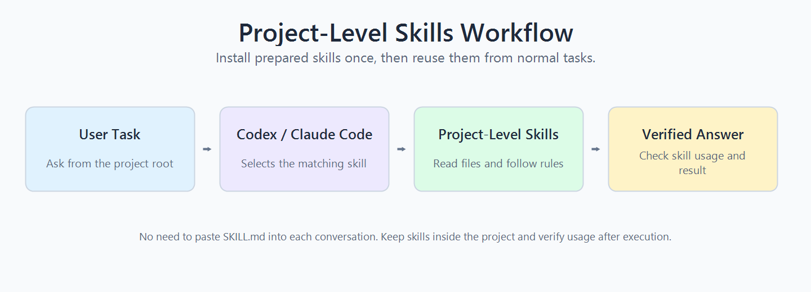

<div align="center">

# Project-Level Skills Guide

**Use prepared skills as reusable project-level capabilities in Codex and Claude Code.**

<p>
  
  
  
  
</p>

</div>

> This guide explains how to install, trigger, verify, and reuse prepared `SKILL.md` files without pasting them into every conversation.

<p align="center">
  
</p>

## 🎬 Demo

This short demo shows a complete project-level skill workflow on a real CSV analysis task. It starts from a clean project folder, checks the available Codex skill with `/skills`, runs a Chicago Food Inspections analysis task, generates a Markdown report and a bar chart, and verifies whether the skill was loaded and followed.

The demo uses the ready-to-use [`csv-analysis`](skills-example/csv-analysis/) skill provided in this repository.

<p align="center">
  <a href="https://youtu.be/SVzxxnxm6Gk">
    
  </a>
</p>

<p align="center">
  <sub>Click the image to watch the demo on YouTube.</sub>
</p>

Watch the demo in either way:

- [Watch online on YouTube](https://youtu.be/SVzxxnxm6Gk)
- [Download the MP4 from GitHub Releases](https://github.com/healer-666/DataMind/releases/download/demo-v1/demo.mp4)

## 🎯 When should you use this guide?

Use this guide if you want to:

| Goal | Meaning |
|---|---|
| Reuse skills | Keep skills in the project instead of uploading them every time |
| Enable auto-triggering | Let Codex or Claude Code select the right skill from the task |
| Keep workflows stable | Make repeated tasks follow the same rules and file-reading process |
| Verify execution | Check whether the skill was actually loaded and followed |

## 🧭 Workflow

| Step | What happens |
|---|---|
| 1. Install | Put prepared `SKILL.md` folders under `.codex/skills/` or `.claude/skills/` |
| 2. Use | Ask a normal task from the project root; the tool can trigger the matching skill |
| 3. Verify | Ask a follow-up check to confirm whether the skill was loaded and followed |

```text
Install skill files
        ↓
Ask a normal task
        ↓
Skill-guided execution
        ↓
Verify skill usage
```

## 🗂️ Recommended Project Layout

Keep source skills and data in stable project directories:

```text
project-root/
├── skills/
│   ├── skill_a/
│   │   └── SKILL.md
│   └── skill_b/
│       └── SKILL.md
└── data/
    ├── dataset.csv
    ├── rules.json
    └── manual.md
```

Then copy the skills you want to enable into the project-level skill directory for Codex or Claude Code.

## 🧩 Skill File Requirements

Each skill should be a standalone folder with a `SKILL.md` file:

```text
skill_name/
└── SKILL.md
```

`SKILL.md` should start with YAML metadata:

```yaml
---
name: skill_name
description: "Describe what task this skill should be used for"
---
```

Keep these requirements in mind:

- Use one folder per skill.
- Keep the file name exactly `SKILL.md`.
- Use `name` as the skill name.
- Use `description` to explain when the tool should load the skill.
- Make the description specific, and quote it if it contains YAML-sensitive punctuation.
- Put long references, scripts, or examples in subfolders if needed.

## 🔧 Installation

| Tool | Project-level skill directory |
|---|---|
| Codex | `.codex/skills/` |
| Claude Code | `.claude/skills/` |

Expected layout:

```text
project-root/
├── .codex/
│   └── skills/
│       └── skill_name/
│           └── SKILL.md
├── .claude/
│   └── skills/
│       └── skill_name/
│           └── SKILL.md
└── data/
    └── dataset.csv
```

If you only use Codex, you only need `.codex/skills/`. If you only use Claude Code, you only need `.claude/skills/`.

After copying the skill folders:

1. Start or reopen Codex / Claude Code from the project root or a child directory.
2. Make sure the current working directory belongs to the project that contains the skill directory.
3. Check that the project-level skills appear in the skill list.

If your Codex environment uses `.agents/skills/` instead of `.codex/skills/`, replace `.codex/skills/` with the directory used by your environment. The important point is that the tool launch location, command execution location, and skill installation location all belong to the same project.

## ✅ Confirm the Setup

Project-level skills only apply to the project where they are installed. If you start the tool from another directory, the configured skills may not appear.

| Check | What to do |
|---|---|
| File check | From the project root, run `find .codex/skills -maxdepth 2 -name SKILL.md -print` or `find .claude/skills -maxdepth 2 -name SKILL.md -print` |
| In-tool check | Start Codex / Claude Code from the project root or a child directory, then open the skill list or enter `/skills` if supported |
| Invocation check | Write `Use <skill-name>` in a task, mention the skill name, or enter `/<skill-name>` if direct skill invocation is supported |

## 🚀 How to Use

After installation, do not paste the `SKILL.md` content into the conversation. Ask the task normally and provide the required data path when needed.

Recommended prompt:

```text
Use the data in <data_path> to answer:

<task_question>

Return only the final answer.
```

If the task does not need data files, ask the question directly:

```text
<task_question>
```

You can also explicitly call a specific skill:

```text
Use <skill_name> to answer this question.
```

## 🔍 Verify Skill Usage

After the task is complete, ask a short follow-up:

```text
Please confirm whether you loaded and used a project-level skill for the previous task. Answer only these fields:

loaded_skill:
skill_name:
followed_skill_instructions:
used_data_files:
evidence:
```

## 🧪 Examples

The demo and the first two examples use ready-to-use example skills provided in [`docs/skills-example/`](skills-example/). These skills were generated by our internal skill generation workflow and can be copied directly into `.codex/skills/` or `.claude/skills/`. The code for generating skills will be open-sourced in a future release.

### Example 1: Query applicable fee IDs

| Field | Value |
|---|---|
| Task type | Merchant + date rule query |
| Skill | `Applicable_Fee_IDs` |
| Source skill | [`docs/skills-example/Applicable_Fee_IDs/`](skills-example/Applicable_Fee_IDs/) |
| Data path | `<project-root>/skill/dabstep_data/context` |
| Expected answer | `64, 123, 304, 381, 384, 454, 473, 572, 595, 678, 813` |
| Observed result | matched in Codex and Claude Code |

<details>
<summary>View prompt, workflow, and observed verification</summary>

Prompt:

```text
Use the data in <project-root>/skill/dabstep_data/context to answer:

For the 200th of the year 2023, what are the Fee IDs applicable to Golfclub_Baron_Friso?

Return only the final answer.
```

Why this triggers the skill:

> This task matches `Applicable_Fee_IDs` because it asks which fee rules apply to a merchant on a specific date.

Skill-guided workflow:

1. Identify the task type: Merchant + Day Query.
2. Extract the merchant: `Golfclub_Baron_Friso`.
3. Extract the date: day 200 of 2023.
4. Map the day to its month to compute monthly volume and fraud brackets.
5. Read `payments.csv` to find transaction combinations for this merchant on that day.
6. Read `merchant_data.json` to get account type, MCC, capture delay, and merchant attributes.
7. Read `fees.json` and apply the fee matching rules defined by the skill.
8. Collect matched Fee IDs and output them in ascending order.

Observed verification:

```text
loaded_skill: yes
skill_name: Applicable_Fee_IDs
used_data_files: yes
model_output: 64, 123, 304, 381, 384, 454, 473, 572, 595, 678, 813
answer_match: yes
```

</details>

### Example 2: Compute an average fee

| Field | Value |
|---|---|
| Task type | Filtered average fee calculation |
| Skill | `Average_Fee_Estimation` |
| Source skill | [`docs/skills-example/Average_Fee_Estimation/`](skills-example/Average_Fee_Estimation/) |
| Data path | `<project-root>/skill/dabstep_data/context` |
| Expected answer | `0.126459` |
| Observed result | matched in Codex and Claude Code |

<details>
<summary>View prompt, workflow, and observed verification</summary>

Prompt:

```text
Use the data in <project-root>/skill/dabstep_data/context to answer:

For credit transactions, what would be the average fee that the card scheme NexPay would charge for a transaction value of 10 EUR?

Return only the final answer.
```

Why this triggers the skill:

> This task matches `Average_Fee_Estimation` because it asks for an average processing fee under a specified transaction value, card scheme, and credit-card condition.

Skill-guided workflow:

1. Identify the task type: Filtered Average.
2. Extract the transaction value: 10 EUR.
3. Extract the card scheme: `NexPay`.
4. Extract the transaction type: credit transactions.
5. Read `fees.json`.
6. Filter fee rules where `card_scheme` is `NexPay`.
7. Apply the credit-card filtering rule defined by the skill.
8. For each applicable rule, compute `fixed_amount + rate * transaction_value / 10000`.
9. Average the computed fees across applicable rules.
10. Output the final numeric value in the required format.

Observed verification:

```text
loaded_skill: yes
skill_name: Average_Fee_Estimation
used_data_files: yes
model_output: 0.126459
answer_match: yes
```

</details>

### Example 3: General CSV sales analysis

| Field | Value |
|---|---|
| Task type | CSV grouped aggregation |
| Skill | `csv-pipeline` |
| Data path | `<project-root>/data/sales.csv` |
| Source skill | [clawhub.ai/skills/csv-pipeline](https://clawhub.ai/skills/csv-pipeline) |
| Expected result | complete product and region revenue summaries |
| Observed result | matched in Codex |

<details>
<summary>View prompt, sample data, workflow, and expected output</summary>

Source:

```text
https://clawhub.ai/skills/csv-pipeline
https://github.com/openclaw/skills/blob/main/skills/gitgoodordietrying/csv-pipeline/SKILL.md
```

Example data structure:

```text
date,region,product,units,unit_price,revenue
2026-01-03,East,Laptop,3,1200,3600
2026-01-04,West,Phone,10,600,6000
...
```

Prompt:

```text
Use the data in <project-root>/data and sales.csv to complete the following analysis:

1. Summarize total_revenue by product, and list every product.
2. Summarize total_revenue by region, and list every region.
3. Identify the product and region with the highest total_revenue.
4. Output the complete summary results as Markdown tables and end with one sentence of conclusion.
```

Skill-guided workflow:

1. Locate `sales.csv`.
2. Read the header and sample rows.
3. Confirm that the file contains `product`, `region`, and `revenue`.
4. Group by `product` and sum `revenue`.
5. Group by `region` and sum `revenue`.
6. Verify that output row counts match the number of unique group keys.
7. Identify the highest-revenue product and region.
8. Output two complete Markdown tables and one sentence of conclusion.

Expected output example:

```text
Verified: the product summary table has 3 rows, matching the 3 unique product values in sales.csv; the region summary table has 4 rows, matching the 4 unique region values.

| product | total_revenue |
|---|---:|
| Laptop | 9600.00 |
| Phone | 15000.00 |
| Tablet | 11200.00 |

| region | total_revenue |
|---|---:|
| East | 8200.00 |
| North | 6400.00 |
| South | 9200.00 |
| West | 12000.00 |

Conclusion: the product with the highest total_revenue is Phone (15000.00), and the region with the highest total_revenue is West (12000.00).
```

Observed verification:

```text
loaded_skill: yes
skill_name: csv-pipeline
used_data_files: yes
model_output: complete product and region summary tables, correctly identifying Phone and West as the highest-revenue entries
answer_match: yes
```

</details>

## 🔔 Troubleshooting

### Skill does not appear

- [ ] The skill is under `.codex/skills/` or `.claude/skills/`.
- [ ] Each skill has its own folder.
- [ ] The file is named exactly `SKILL.md`.
- [ ] The metadata starts and ends with `---`.
- [ ] The metadata contains `name` and `description`.
- [ ] The description is valid YAML.
- [ ] The tool was reopened after the skill directory was created.
- [ ] Codex / Claude Code was started from the project root or a child directory.

### Skill appears but is not used

- [ ] Make the `description` more specific to the task type.
- [ ] Mention the skill name explicitly in the task once to test invocation.
- [ ] Confirm that the data path in the prompt points to the project where the skill is installed.
- [ ] Ask the verification follow-up to check whether the skill was loaded and followed.
