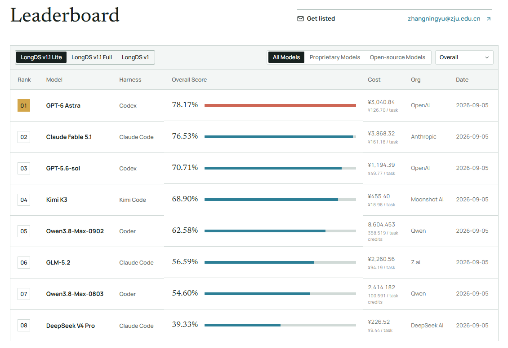

<h1 align="center">LongDS-Bench</h1>

<p align="center">
  <a href="https://zjunlp.github.io/DataMind/">🌐 Website</a> •
  <a href="https://arxiv.org/abs/2605.30434">📖 Paper</a> •
  <a href="https://huggingface.co/datasets/zjunlp/LongDS">🤗 Dataset</a> •
  <a href="https://zjunlp.github.io/DataMind/#leaderboard">📊 Leaderboard</a> •
  <a href="https://github.com/zjunlp/DataMind">💻 GitHub</a>
</p>

**LongDS evaluates long-horizon, multi-turn agentic data analysis:** can an agent preserve, update, and reuse the right analytical state throughout an evolving workflow?

> **LongDS v1.1 is available! We recommend LongDS v1.1 Lite for new evaluations.**
> Evaluate your model or agent on 24 complete tasks spanning 777 turns, and share your results with the community!

## News

- **LongDS v1.1 and v1.1 Lite released**, with refined task specifications and native runners for Codex, Claude Code, Kimi Code, and Qoder.
- Our paper, *LongDS-Bench: On the Failure of Long-Horizon Agentic Data Analysis*, has been accepted to the **EMNLP 2026 Main Conference**.

## Contents

- [What's new in v1.1](#whats-new-in-v11)
- [Overview](#overview)
- [Quick start](#quick-start)
- [Example: run v1.1 Lite with Codex](#example-run-v11-lite-with-codex)
- [Results and leaderboard](#results-and-leaderboard)
- [Acknowledgements](#acknowledgements)
- [Citation](#citation)

## What's new in v1.1

### Clearer task specifications

We conducted a comprehensive audit of the benchmark, refining **task scopes, tie-breaking rules, output conventions, and the semantics of inherited states**. These changes improve clarity, consistency, and evaluation rigor while preserving the core analytical logic and long-horizon dependencies.

### v1.1 Lite: the recommended starting point

**LongDS v1.1 Lite contains 24 carefully selected tasks and 777 turns**, covering all six domains and diverse state-evolution behaviors. The subset focuses on tasks that are empirically solvable while remaining discriminative across agents, making evaluation faster and less costly without removing the challenge of long-horizon state management.

Lite selects **complete tasks** from v1.1 Full. The task content and all turns within each selected task are identical; Lite does not truncate conversations. The full collection contains 68 tasks and 2,225 turns. v1 remains available for historical comparisons.

The runners default to `--longds_version v1.1 --split lite`. Always report the version and split with your scores; results from different task versions should not be treated as directly interchangeable.

### Native agent runners

In addition to DSGym, LongDS supports **Codex, Claude Code, Kimi Code, and Qoder** through their native CLI runtimes. All four CLI runners support local and Docker execution. In Docker mode, each task uses an isolated container, with a persistent native agent session across its turns.

## Overview

Real-world data analysis is rarely a sequence of independent questions. Filters, metric definitions, assumptions, intermediate tables, and branch-specific results evolve over many turns. LongDS tests whether agents can maintain, update, and apply these analytical states correctly.

The complete benchmark contains **68 tasks and 2,225 turns** across **Business, Community, Education, Geoscience, Social Good, and Sports**. It is constructed from real-world Kaggle notebooks and datasets through source filtering, task construction, expert review, semi-automated validation, and consistency checks.

<p align="center">
  
</p>

LongDS covers six representative state-evolution patterns: **initial state construction, state inheritance, state update, counterfactual perturbation, rollback, and multi-state composition**.

<p align="center">
  
</p>

### LongDS v1.1 Lite leaderboard

The updated leaderboard presents results for models evaluated through their native agent frameworks on **LongDS v1.1 Lite**. In the snapshot below, **GPT-6 Astra / Codex** achieves **78.17%**, followed by **Claude Fable 5.1 / Claude Code** at **76.53%** and **GPT-5.6-sol / Codex** at **70.71%**. Scores are averaged equally across tasks.

We welcome the community to evaluate more models and agent frameworks on **LongDS v1.1** and share their results. Visit the [live leaderboard](https://zjunlp.github.io/DataMind/#leaderboard) for detailed results and updates.

<p align="center">
  <a href="https://zjunlp.github.io/DataMind/#leaderboard">
    
  </a>
</p>

<details>
<summary>Original paper experiments</summary>

The original paper studies performance across task progress, dependency breadth, and state-evolution patterns. These figures describe the original experimental setting, not the updated v1.1 leaderboard. See the [leaderboard](https://zjunlp.github.io/DataMind/#leaderboard) for v1.1 results.

Experimental results show that LongDS remains challenging for both proprietary and open-source models. The best-performing model, Gemini-3.1-Pro, reaches only 48.45 average accuracy, while GPT-5.4 and Claude-4.6-Sonnet obtain 43.50 and 41.56, respectively. Performance varies substantially across domains: models perform relatively better on Education but struggle on Geoscience, Business, and Sports, where long-horizon feature engineering and state management are more demanding.

Further analysis reveals consistent degradation as tasks become longer and more state-dependent. Model accuracy drops sharply along task progress, decreases as dependency breadth increases, and becomes lower under more complex state-evolution patterns such as counterfactual perturbation and rollback. These trends suggest that the main bottleneck is maintaining a correct evolving analytical state rather than simply increasing the interaction budget.

<p align="center">
  
  
</p>

</details>

## Quick start

**Run commands from the `longds/` root.** Edit model configuration in the corresponding `runners/<runner>/` directory; default outputs go to `longds/results/`.

### 1. Download the dataset

Use the Hugging Face CLI to download the [released dataset](https://huggingface.co/datasets/zjunlp/LongDS). The command below downloads the entire repository, including both task versions and shared input data:

```bash
cd /path/to/DataMind/longds
hf download zjunlp/LongDS --repo-type dataset --local-dir dataset
```

For more targeted downloads, see the [download instructions on Hugging Face](https://huggingface.co/datasets/zjunlp/LongDS#download):

- **v1.1 Lite only:** download the 24 selected tasks and their corresponding input data.
- **v1.1 Full:** download all v1.1 tasks and the shared input data.
- **Upgrade from v1:** reuse your existing input data and download only the updated v1.1 task files.

All options preserve the same `longds/dataset/` layout used by the runners.

The versioned task definitions share the same raw data:

```text
dataset/
├── data/longds/{domain}/{dataset}/taskN/data/...
└── task/
    ├── longds_v1/...
    └── longds_v1.1/
        ├── task_list_lite.json
        ├── task_list_full.json
        └── {domain}/{dataset}/taskN/task.json
```

If you already have an older download, update it and confirm that `dataset/task/longds_v1.1/task_list_lite.json` exists. The runners do not silently fall back to v1 when the selected task list is missing.

### 2. Set up a runner

Choose a runner and follow its guide to install dependencies, configure model access, and build the Docker image if using Docker. The CLI runner environments use Python 3.12; DSGym additionally uses `uv` and a Docker Compose executor pool.

| Runner | Guide | Model configuration |
| --- | --- | --- |
| Codex | [Setup and usage](runners/codex/README.md) | `runners/codex/config.toml` |
| Claude Code | [Setup and usage](runners/claude_code/README.md) | `runners/claude_code/settings.json` |
| Kimi Code | [Setup and usage](runners/kimi_code/README.md) | `runners/kimi_code/config.toml` |
| Qoder | [Setup and usage](runners/qoder_cli/README.md) | `runners/qoder_cli/settings.json` plus Qoder authentication |
| DSGym | [Setup and usage](runners/DSGym/README.md) | Provider environment variables / LiteLLM |

Use the example configuration files as templates and supply your own credentials. Keep credentials out of commits and shared result files.

### 3. Evaluate v1.1 Lite

Configure the judge endpoint before running with `--judge`:

```bash
export JUDGE_API_KEY="<your_judge_api_key>"
export JUDGE_BASE_URL="<your_judge_base_url>"
```

For the CLI runners, the judge model defaults to `deepseek-v4-pro`; set `JUDGE_MODEL` if your endpoint uses another model name.

After completing the selected runner's setup, run **one** of the following commands from `longds/`:

```bash
python runners/codex/run_codex_longds.py --use-docker --run-parallel 4 --judge
python runners/claude_code/run_claude_longds.py --use-docker --run-parallel 4 --judge
python runners/kimi_code/run_kimi_longds.py --use-docker --run-parallel 4 --judge
python runners/qoder_cli/run_qoder_longds.py --use-docker --run-parallel 4 --judge
```

These commands evaluate **all 24 Lite tasks and all 777 turns**. No version, split, output directory, or run name argument is needed. Four tasks run concurrently; turns within a task remain sequential. Each CLI turn has a default timeout of **3600 seconds (one hour)**, configurable with `--timeout`. Evaluation consumes model and judge API usage.

For a small connectivity check, add `--task-limit 1 --turn-limit 1`. To run v1.1 Full, add `--split full`; for v1, add `--longds_version v1 --split full`.

## Example: run v1.1 Lite with Codex

This example runs the complete v1.1 Lite benchmark with **Codex in Docker**, including automatic judging. You need Docker installed and running, access to a Codex-compatible Responses API endpoint, and a judge endpoint. Codex and the data-analysis environment run inside Docker; you do not need to install the Codex CLI on the host or start the DSGym executor pool.

### Step 1. Prepare the host Python environment

Enter your checkout's `longds/` directory. Run all subsequent commands from this directory and the same shell. If you already have a Python 3.12 environment, activate it and skip creating a new one.

```bash
cd /path/to/DataMind/longds

conda create -n longds python=3.12 -y
conda activate longds
python -m pip install openai huggingface_hub
```

The host runs the Python launcher and judge. `openai` is needed for judging, and `huggingface_hub` provides the dataset download command. Data-analysis packages are installed in the Docker image in Step 4.

### Step 2. Download the data

Skip this step if the versioned tasks and their input data are already present.

```bash
hf download zjunlp/LongDS --repo-type dataset --local-dir dataset
```

This downloads the entire dataset repository. For a smaller download, use the [Lite-only instructions](https://huggingface.co/datasets/zjunlp/LongDS#download-longds-v11-lite). Before continuing, confirm that `dataset/task/longds_v1.1/task_list_lite.json` and the selected tasks' data under `dataset/data/longds/` are available.

### Step 3. Configure Codex and the judge

Create the local Codex configuration from the template. The command below leaves an existing configuration untouched:

```bash
cp -n runners/codex/config.example.toml runners/codex/config.toml
```

Open `runners/codex/config.toml` in your editor and set:

- `model`: the model name exposed by your endpoint.
- `model_reasoning_effort`: the reasoning effort supported by the selected model.
- `model_providers.longds_env.base_url`: your Responses API base URL.
- `model_providers.longds_env.experimental_bearer_token`: your API key.

Keep `model_provider = "longds_env"` and `wire_api = "responses"` for this configuration. This example uses API-key authentication; for ChatGPT login-based authentication, see the [Codex guide](runners/codex/README.md).

Configure the separate judge connection in the current shell:

```bash
export JUDGE_API_KEY="<your_judge_api_key>"
export JUDGE_BASE_URL="<your_judge_base_url>"
export JUDGE_MODEL="deepseek-v4-pro"
```

Replace the placeholders with your endpoint details, and change `JUDGE_MODEL` if needed. The judge endpoint must support Chat Completions. Do not commit credentials; `runners/codex/config.toml` is Git-ignored.

### Step 4. Build the Docker images

Build the shared data-analysis base image, then the image containing the Codex CLI. You only need to rebuild when updating the environment or CLI version.

```bash
docker build -t executor-prebuilt runners/DSGym/executors/container_images/longds_image
docker build -t longds-codex:latest runners/codex
```

The runner starts a separate container for each task, copies in that task's raw data, and keeps the same Codex session across its turns. The first build downloads dependencies and requires sufficient disk space.

### Step 5. Check one task and one turn

Verify model access, data analysis, and judging before starting the complete evaluation:

```bash
python runners/codex/run_codex_longds.py \
  --use-docker \
  --task-limit 1 \
  --turn-limit 1 \
  --judge
```

This is a real, billable evaluation, not a dry run. Check the printed output path and its `summary.json`: execution should complete, and the turn should be judged without errors. An incorrect answer is a model result, not necessarily a setup failure. This one-turn run is not a complete Lite score.

### Step 6. Run all of v1.1 Lite

Remove the task and turn limits to evaluate all **24 tasks / 777 turns**:

```bash
python runners/codex/run_codex_longds.py \
  --use-docker \
  --run-parallel 4 \
  --judge
```

The defaults select v1.1 Lite and allow up to one hour per turn. Four tasks run concurrently; reduce `--run-parallel` if your machine or API quota cannot support that concurrency. Each invocation gets a new automatic run name, so this evaluation is saved separately from the one-turn check.

### Step 7. Inspect the results

The terminal prints the experiment's `summary.json` path. With the template model name, it has this form:

```text
results/longds_v1.1_lite/codex_gpt-5.6-sol_<timestamp>/summary.json
```

For a complete Lite evaluation, check that `selected_tasks`, `completed_tasks`, and `judged_tasks` are all **24**, with no task or judge failures and no turn limit. Read `task_avg_score` for the task-averaged result; multiply by 100 to express it as a percentage. Individual task answers, scores, and execution traces are under `{domain}/{dataset}/taskN/` in the same run directory.

## Results and leaderboard

Each CLI runner and DSGym writes an experiment-level overview when the run finishes:

```text
results/longds_v1.1_lite/{run_name}/
├── summary.json
└── {domain}/{dataset}/taskN/
    ├── task_metadata.json
    ├── results.json
    ├── results_eval.json
    └── ...
```

- **`summary.json`**: model, selection and limits, task execution counts, judged task count, and `task_avg_score`.
- **`results_eval.json`**: per-turn judge scores and the task's average score.
- CLI runs also retain `detail/` and `workspace/`; DSGym retains its trajectory and execution artifacts. See the corresponding runner guide for details.

`task_avg_score` is the **equal-weight mean of fully judged task averages**, on a 0–1 scale. Check `judged_tasks` and the task/turn limits alongside the score: unjudged or incomplete tasks are excluded, not counted as zero. No separate summary command is needed.

**We welcome evaluations on LongDS v1.1 Lite!** Explore the [leaderboard](https://zjunlp.github.io/DataMind/#leaderboard) and share new model or agent results through a [GitHub issue](https://github.com/zjunlp/DataMind/issues), or contact us by email at [kewe1x@163.com](mailto:kewe1x@163.com) or [zhangningyu@zju.edu.cn](mailto:zhangningyu@zju.edu.cn). Include the benchmark version and split, model and agent, relevant settings, task coverage, score, and execution trajectories. Please identify partial runs clearly and remove credentials before sharing artifacts.

## Acknowledgements

We thank the [DSGym](https://github.com/fannie1208/DSGym) team for their open-source evaluation framework and Docker-based execution infrastructure. See their [paper](https://arxiv.org/abs/2601.16344) for details.

## Citation

If you use LongDS, please cite:

```bibtex
@misc{xu2026longdsbench,
      title={LongDS-Bench: On the Failure of Long-Horizon Agentic Data Analysis},
      author={Kewei Xu and Xiaoben Lu and Shuofei Qiao and Zihan Ding and Haoming Xu and Lei Liang and Ningyu Zhang},
      year={2026},
      eprint={2605.30434},
      archivePrefix={arXiv},
      primaryClass={cs.LG},
      url={https://arxiv.org/abs/2605.30434},
}
```
