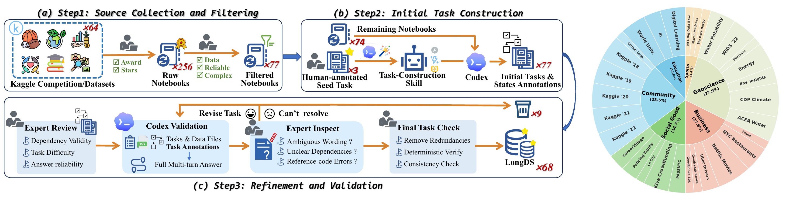
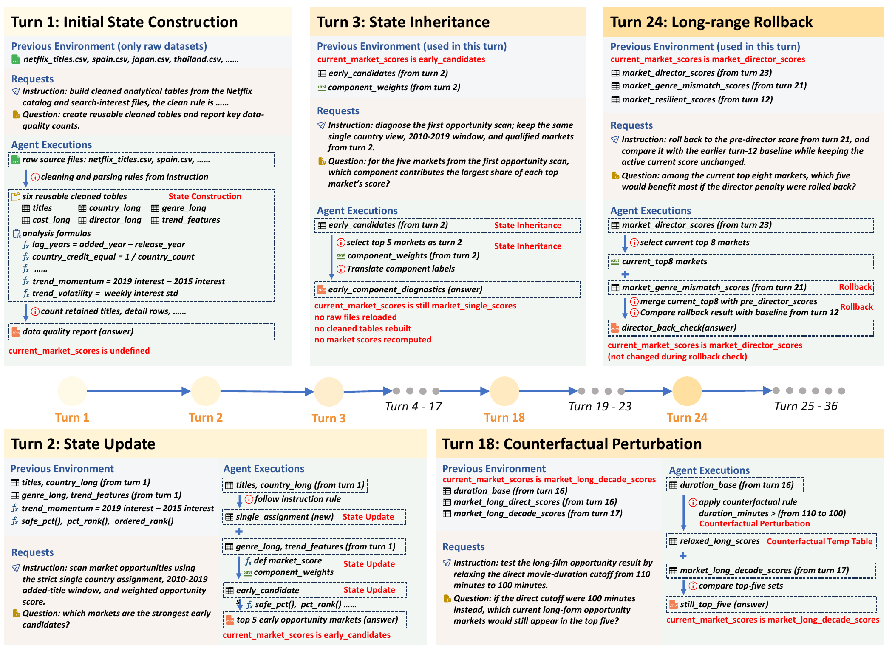
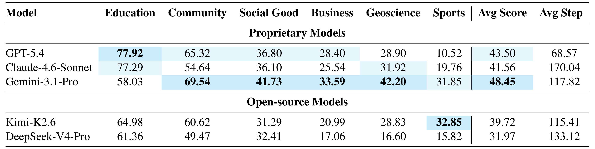
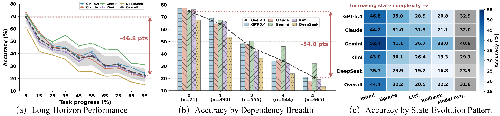

<h1 align="center"> LongDS-Bench </h1>

<p align="center">
  <a href="https://github.com/zjunlp/DataMind">💻 GitHub</a> •
  <a href="https://huggingface.co/datasets/zjunlp/LongDS">🤗 Hugging Face</a> •
  <a href="https://huggingface.co/collections/zjunlp/datamind">📚 DataMind Collection</a>
</p>

## Table of Contents

- 👀 [Overview](#overview)
- 🔧 [Installation](#installation)
  - 📋 [Prerequisites](#-prerequisites)
  - ⚙️ [Environment Setup](#️-environment-setup)
  - 🐳 [Execution Environment](#-execution-environment)
- 📦 [Data](#data)
- 💻 [Running LongDS using DSGym](#running-longds-using-dsgym)
  - [1. Configure Model Access](#1-configure-model-access)
  - [2. Run Evaluation](#2-run-evaluation)
  - [3. Outputs](#3-outputs)
- 💻 [Running LongDS using Agent-Agnostic Runner](#running-longds-using-agent-agnostic-runner)
- 💻 [Running LongDS using Codex](#running-longds-using-codex)
- 💻 [Running LongDS using Claude Code](#running-longds-using-claude-code)
- 🙏 [Acknowledgements](#acknowledgements)
- 📖 [Citation](#citation)

---

## 👀 Overview

### Introduction

**LongDS** is a benchmark for evaluating long-horizon, multi-turn agentic data analysis. Real-world analysis is rarely a sequence of independent questions: filters, metric definitions, assumptions, intermediate tables, and branch-specific results evolve over many turns. LongDS tests whether agents can maintain, update, and apply these evolving analytical states correctly.

LongDS contains **68 tasks** and **2,225 turns** across six domains: Business, Community, Education, Geoscience, Social Good, and Sports. It is constructed from real-world Kaggle notebooks and datasets through source filtering, initial task construction, expert review, semi-automated validation, and final consistency checks.

<p align="center">
  
</p>

### State-Evolution Patterns

**LongDS** covers representative state-evolution patterns that commonly arise in long-horizon data analysis:

- **Initial state construction**, where the agent builds reusable analytical context from raw data.
- **State inheritance**, where later turns depend on definitions or intermediate results from earlier turns.
- **State update**, where the analytical state must be revised as new constraints are introduced.
- **Counterfactual perturbation**, where the agent must reason under changed assumptions.
- **Rollback**, where the agent returns to an earlier state and continues from it.
- **Multi-state composition**, where multiple previous states must be combined.

<p align="center">
  
</p>

### Experimental Results

Experimental results show that LongDS remains challenging for both proprietary and open-source models. The best-performing model, Gemini-3.1-Pro, reaches only **48.45** average accuracy, while GPT-5.4 and Claude-4.6-Sonnet obtain **43.50** and **41.56**, respectively. Performance varies substantially across domains: models perform relatively better on Education but struggle on Geoscience, Business, and Sports, where long-horizon feature engineering and state management are more demanding.

Further analysis reveals consistent degradation as tasks become longer and more state-dependent. Model accuracy drops sharply along task progress, decreases as dependency breadth increases, and becomes lower under more complex state-evolution patterns such as counterfactual perturbation and rollback. These trends suggest that the main bottleneck is maintaining a correct evolving analytical state rather than simply increasing the interaction budget.

<p align="center">
  
  
</p>


## 🔧 Installation

The paper experiments use [DSGym](https://arxiv.org/abs/2601.16344), which provides Docker-based execution infrastructure for code-based data analysis.
LongDS also includes an agent-agnostic runner based on the LDC Labs [longds-bench](https://github.com/ldclabs/longds-bench) skill for evaluating agents that execute the benchmark with their own shell/code tools; see [runners/agent_agnostic/README.md](runners/agent_agnostic/README.md).
LongDS also provides direct Codex and Claude Code runners for evaluating agents through their own CLI runtimes.

Follow the [DSGym](https://github.com/fannie1208/DSGym) setup instructions to configure the evaluation environment.

### 📋 Prerequisites

- Python 3.12
- Docker and Docker Compose
- `uv`

### ⚙️ Environment Setup

```bash
cd DataMind/longds/runners/DSGym

# Install main dependencies (includes litellm by default)
uv sync
```

### 🐳 Execution Environment

LongDS uses DSGym's container manager to allocate isolated Python execution environments.

Build and start the LongDS executor pool:

> Note: The complete executor image is approximately 12 GB. Ensure sufficient disk space and a stable network connection before building.

```bash
cd DataMind/longds/runners/DSGym/executors

docker build -t executor-prebuilt ./container_images/longds_image
docker build -t manager-prebuilt ./manager

python generate_compose.py \
  -n 8 \
  --types "executor-prebuilt:8" \
  -m ../../../dataset/data

docker compose -f docker-compose.yml up -d --build
```

From `runners/DSGym/executors/`, `../../../dataset/data` resolves to `longds/dataset/data` and is mounted read-only at `/data` in each executor.

> If manager-to-executor requests return `502 Bad Gateway` while using a proxy or VPN, add the Docker service names to `NO_PROXY`.

Stop the executor pool:

```bash
cd DataMind/longds/runners/DSGym/executors
docker compose -f docker-compose.yml down
```

## 📦 Data

LongDS expects the following layout under `longds/dataset/`:

```text
dataset/
├── data/
│   └── longds/
│       └── {domain}/{dataset}/taskN/data/...
└── task/
    └── longds/
        ├── task_list.json
        └── {domain}/{dataset}/taskN/
            ├── task.ipynb
            ├── task.py
            ├── task.json
            └── metadata.json
```

You can download the released data from [Hugging Face](https://huggingface.co/datasets/zjunlp/LongDS):

```bash
cd /path/to/DataMind/longds
hf download zjunlp/LongDS \
  --repo-type dataset \
  --local-dir dataset
```

## 💻 Running LongDS using DSGym

Run LongDS using `runners/DSGym/scripts/longds.py`.

### 1. Configure Model Access

For API-based models via LiteLLM, set the required environment variables for your provider.

OpenAI-compatible example:

```bash
export OPENAI_API_KEY="<your_openai_compatible_api_key>"
export OPENAI_BASE_URL="<your_openai_compatible_base_url>"
```

Anthropic example:

```bash
export ANTHROPIC_API_KEY="<your_anthropic_api_key>"
export ANTHROPIC_BASE_URL="<your_anthropic_base_url>"
```

LongDS also runs an LLM-as-judge evaluation after each task. Configure the judge endpoint as follows:

```bash
export JUDGE_API_KEY="<your_judge_api_key>"
export JUDGE_BASE_URL="<your_judge_base_url>"
```

The judge model defaults to `deepseek-v4-pro`. Use `--judge-model` if your endpoint uses a different model name.

### 2. Run Evaluation

Evaluate all LongDS tasks:

```bash
cd DataMind/longds/runners/DSGym/scripts

uv run python longds.py \
  --dataset longds \
  --model openai/<your_model_name> \
  --backend litellm \
  --output-dir ./results
```

#### Example:
Run one task for its first three turns using deepseek-v4-pro:

```bash
uv run python longds.py \
  --dataset longds \
  --model openai/deepseek-v4-pro \
  --backend litellm \
  --output-dir ./results \
  --task-limit 1 \
  --turn-limit 3
```

Useful options:

```text
--task-limit N        Evaluate at most N task directories.
--start-index N       Start from the task directory at index N in task_list.json.
--turn-limit N        Evaluate at most N turns per task.
--max-steps N         Maximum agent steps per turn. Default: 40.
--judge-model NAME    Judge model name. Default: deepseek-v4-pro.
```

### 3. Outputs

For each task, LongDS writes results under:

```text
{output_dir}/longds/{domain}/{dataset}/taskN/{model_name}_{timestamp}/
├── traj.json          # full multi-turn conversation and solutions
├── results.json       # per-turn trajectories before judging
├── results_eval.json  # per-turn trajectories with LLM judge scores
├── code.py            # extracted Python code from model responses
└── bak/               # intermediate execution records
```

The main evaluation score is stored in `results_eval.json`, where each turn receives a judge score and the final element contains a summary with the average score.

## 💻 Running LongDS using Agent-Agnostic Runner

If you want the agent itself to act as the runtime under test, use the agent-agnostic runner instead of DSGym. This method does not start Docker executors or call a model through LiteLLM; the agent reads `runners/agent_agnostic/longds_bench/SKILL.md`, uses its own tools and a persistent Python session, and writes answers for later judging.

For setup, pilot runs, scoring, and comparability notes, see [runners/agent_agnostic/README.md](runners/agent_agnostic/README.md).

## 💻 Running LongDS using Codex

Use the Codex runner when you want the Codex CLI itself to execute LongDS tasks without DSGym Docker executors or LiteLLM. The runner starts `codex exec` sessions, resumes the same session across turns in a task, copies each task's released data into an isolated workspace, and stores per-turn outputs for later judging.

Quick start:

```bash
cd DataMind/longds/runners/codex

conda create -n longds python=3.12 -y
conda activate longds
pip install --upgrade pip
pip install -r requirements-environment.txt

codex login

python run_codex_longds.py \
  --task-limit 1 \
  --turn-limit 1
```

After a run finishes, you can reopen the codex session from `runners/codex/results/<domain>/<dataset>/<task_id>/<run_name>/workspace`; the session ID is recorded in `runners/codex/results/<domain>/<dataset>/<task_id>/<run_name>/summary.json`.

You can also configure the judge endpoint and score the Codex outputs:

```bash
export JUDGE_API_KEY="<your_judge_api_key>"
export JUDGE_BASE_URL="<your_judge_base_url>"

python judge.py
```

The runner writes results under `runners/codex/results/<domain>/<dataset>/<task_id>/<run_name>/`. The judge skips runs that already have `results_eval.json` unless `--overwrite` is passed. For full setup, options, output layout, and judge behavior, see [runners/codex/README.md](runners/codex/README.md).

## 💻 Running LongDS using Claude Code

Use the Claude Code runner when you want Claude Code itself to execute LongDS tasks without DSGym Docker executors or LiteLLM. The runner starts `claude -p` sessions, reuses the same Claude session id across turns in a task, copies each task's released data into an isolated workspace, and stores per-turn outputs for later judging.

Quick start:

```bash
cd DataMind/longds/runners/claude_code

conda create -n longds python=3.12 -y
conda activate longds
pip install --upgrade pip
pip install -r requirements-environment.txt

claude

python run_claude_longds.py \
  --task-limit 1 \
  --turn-limit 1
```

After a run finishes, you can reopen the claude code session from `runners/claude_code/results/<domain>/<dataset>/<task_id>/<run_name>/workspace`; the session ID is recorded in `runners/claude_code/results/<domain>/<dataset>/<task_id>/<run_name>/summary.json`.

You can also configure the judge endpoint and score the Claude Code outputs:

```bash
export JUDGE_API_KEY="<your_judge_api_key>"
export JUDGE_BASE_URL="<your_judge_base_url>"

python judge.py
```

The runner writes results under `runners/claude_code/results/<domain>/<dataset>/<task_id>/<run_name>/`. The judge skips runs that already have `results_eval.json` unless `--overwrite` is passed. For full setup, options, output layout, and judge behavior, see [runners/claude_code/README.md](runners/claude_code/README.md).


## 🙏 Acknowledgements

We thank the [DSGym](https://github.com/fannie1208/DSGym) team for their open-source evaluation framework. We adapted DSGym's evaluation pipeline to support long-horizon, multi-turn data analysis tasks and use DSGym's Docker-based execution infrastructure. For more details about DSGym, please refer to their [paper](https://arxiv.org/abs/2601.16344).

We also thank [LDC Labs](https://github.com/ldclabs) for open-sourcing the agent-agnostic [longds-bench](https://github.com/ldclabs/longds-bench) skill, which supports running LongDS-Bench with the agent itself as the runtime under test.

## 📖 Citation

If you use LongDS, please cite:

```bibtex
@misc{xu2026longdsbench,
      title={LongDS-Bench: On the Failure of Long-Horizon Agentic Data Analysis}, 
      author={Kewei Xu and Xiaoben Lu and Shuofei Qiao and Zihan Ding and Haoming Xu and Lei Liang and Ningyu Zhang},
      year={2026},
      eprint={2605.30434},
      archivePrefix={arXiv},
      primaryClass={cs.LG},
      url={https://arxiv.org/abs/2605.30434}, 
}
```
